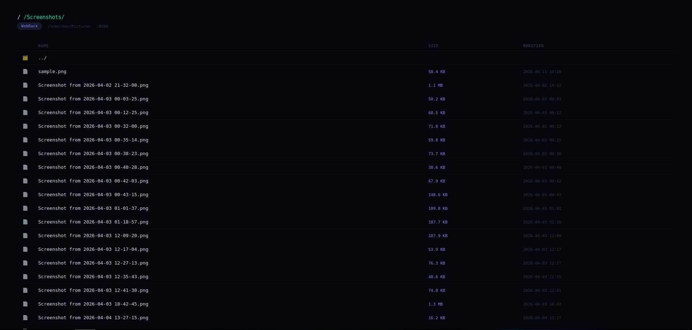
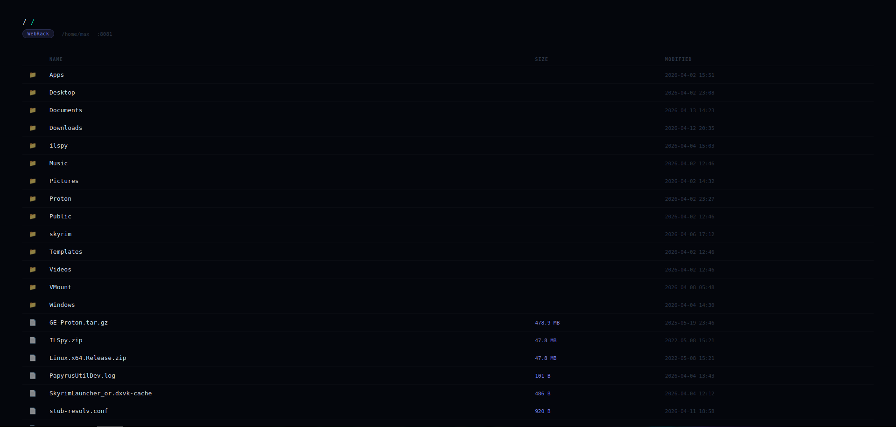

# WebRack
Python+Flask, Directory Server/Web.

Will serve directories if no index.html found to serve via modules path.

Description to be updated later to be more in depth.
V3 uploading soon. Then will do new description.

